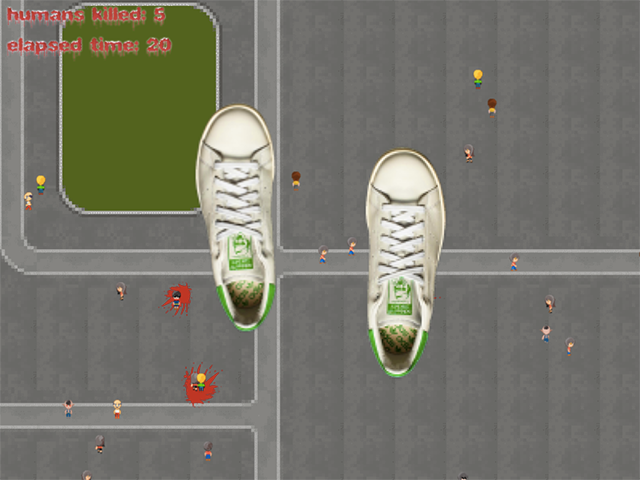

This was my LDJAM entry for Ludum Dare #38. For details on the
development of the game, please read the [Post
Mortem](http://makenai.net/Ludum-Dare-38-Postmortem/).

You were sitting in your living room, playing a video game and minding
your own business until you accidentally ate a RADIOACTIVE CHEETO. Now
you are 500 feet tall and must get out of the city while causing as
little carnage as possible.

**OPT OUTS:** I am opting out of graphics, sound and music as they were
either from opengameart or randomly generated.

This is my first ldjam, and first game in probably 15 years or so. I've
made this using Phaser as I am a JavaScript developer for my normal day
job and it seemed smart go with what I know! Other tools used: Tiled,
Aseprite, bfxr, Wolfram Tones, Texture Packer, and Photoshop.

# Running / Building

This game uses PhaserJS and specifically a convenience package called [phaser-node-kit](https://www.npmjs.com/package/phaser-node-kit). In order to run it locally, you'll need to have nodejs installed on your computer with npm configured. This is automatically present on OSX.

You'll need to install phaser-node-kit, and then run the local web server:

```bash
$ npm install -g phaser-node-kit
$ pnkit watch
```

After that, just navigate to http://localhost:5550/

If you don't want to do this, there is a version of the entire game precompiled in the `build` directory, but you will need to run it through a local webserver for assets to work. You can try `python -m SimpleHTTPServer` from within build to run on port 8000.

The source code in `game/js` is probably easier to look at though.

# Links

* SITE: [NO STEP ON
  HYOOMINS](https://makenai.itch.io/no-step-on-hyoomins)
* Postmortem: [LD38 - "NO STEP ON HYOOMINS"
  Postmortem](http://makenai.net/Ludum-Dare-38-Postmortem/)
* TWITTER: [makenai](http://twitter.com/makenai)
* TIMELAPSE: [LD38
  Timelapse](https://www.youtube.com/watch?v=ZYQxab8NXqo)
